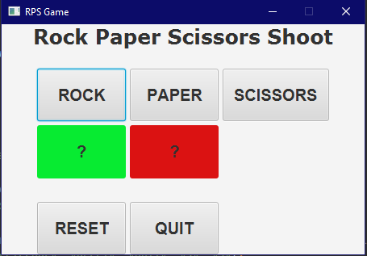
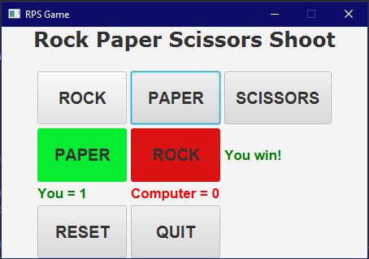
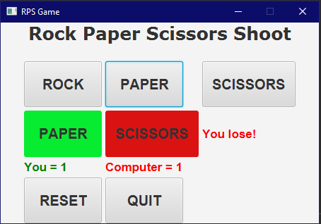
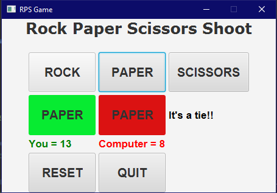

Rock Paper Scissors Game
========================
Created by : Davis Insua

ABOUT 
----------------

This is a java application using the JavaFX application platform that simulates a rock paper scissors game. The application utilizes makes great use of the ArrayList data structure to quickly initialize GUI elements, Loops to efficiently modify GUI elements, and a comprehensive handle action function that drives the game. The player can choose between any option by pressing the button desired, and the AI will make their choice as well. The code checks and declares a winner, and the player or AI gets a point. Every game element is represented in the user interface. The player can also reset all scores or quit the game with the respective buttons.

SCREENSHOTS  
--------------

The initial interface when the game is launched. This is also what the game resets to when the player presses the reset button.

A showcase of a tie, where the AI and Player both pick rock. No score is added to each side.

Player wins the round, has their score updated.

Ai wins the round, their score is updated.

Late into the game.
